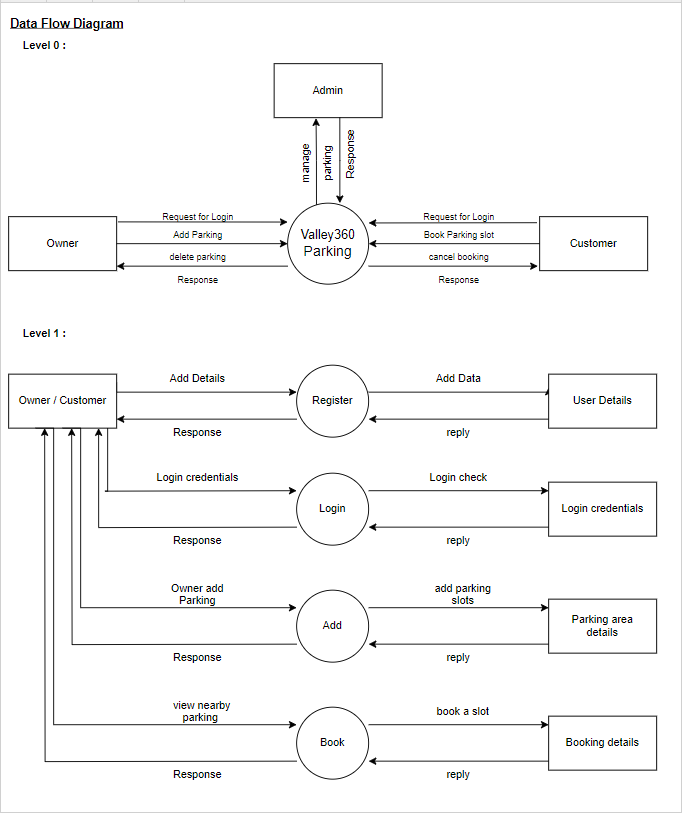
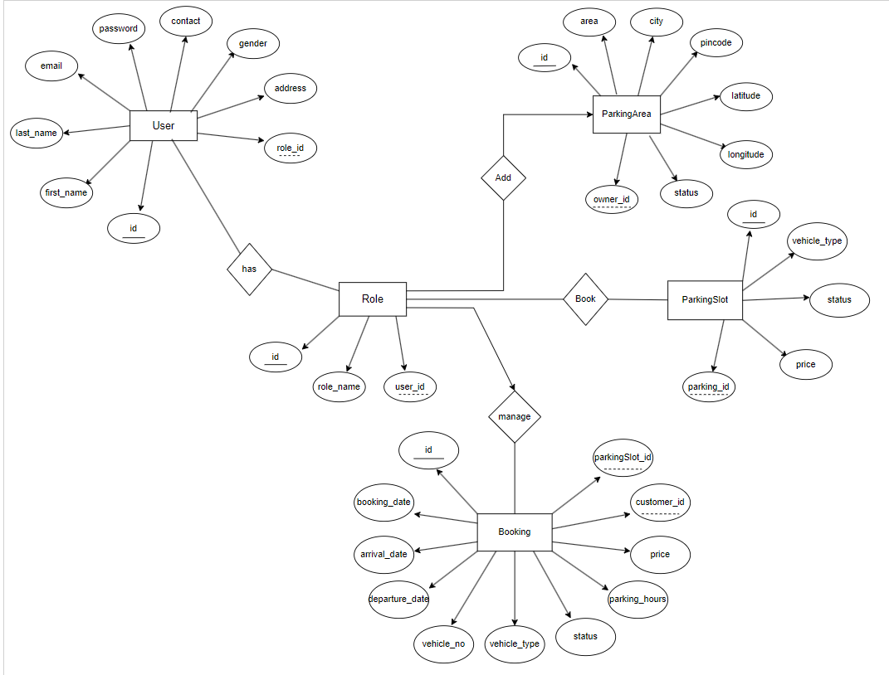

# Valley 360 Smart Parking System

A full-stack smart parking application for managing parking areas, slots, users, and bookings with role-based access.

## Overview

Valley 360 Smart Parking System centralizes parking management for administrators, parking owners, and customers in one web application.

It solves the manual coordination problem common in parking operations by letting owners publish parking areas and slots, customers browse and book available spaces, and administrators oversee the platform from a single dashboard.

The core idea is simple: keep parking inventory visible, controlled, and bookable through a secure role-based workflow.

## Features

### Admin

- Manage owner and customer accounts.
- View all parking areas and parking slots.
- Monitor platform-wide parking inventory.

### Owner

- Add and update parking areas.
- Manage parking slots for assigned parking areas.
- Review booking activity for owned parking spaces.

### Customer

- Browse available parking areas.
- View parking slots for a selected area.
- Book parking slots through the web interface.

### Authentication

- JWT-based login and registration.
- Role-based access for admin, owner, and customer users.

## System Architecture

Valley 360 follows a standard three-tier flow where the React frontend sends API requests to the Spring Boot backend, the backend processes business rules and security checks, and MySQL persists application data.

- React frontend sends API requests to the backend.
- Spring Boot backend processes business logic and validation.
- MySQL database stores users, parking areas, slots, and booking records.
- JWT secures protected requests between the frontend and backend.

## Database Design

The data model centers on the core parking workflow:

- User: stores account information for admins, owners, and customers.
- Role: defines the access level for each user.
- ParkingArea: represents a parking location owned and managed by an owner.
- ParkingSlot: represents individual slots within a parking area.
- Booking: stores slot reservations made by customers.

Key relationships:

- One Owner -> Many Parking Areas.
- One Parking Area -> Many Slots.
- One Customer -> Many Bookings.

## Authentication Flow

The application uses JWT for secure authentication and authorization.

1. User logs in through the login API.
2. Backend validates the credentials.
3. If valid, the backend generates a JWT token.
4. The token is sent back to the frontend.
5. The frontend stores the token in localStorage.
6. Axios sends the token in request headers as `Authorization: Bearer <token>`.
7. The backend validates the token for protected endpoints before processing the request.

## Application Flow

After login, users are routed based on their role:

- Admin -> Admin Dashboard
- Owner -> Owner Dashboard
- Customer -> User Dashboard

High-level request flow:

- login -> dashboard -> action -> API request -> database update -> response

## Tech Stack

### Frontend

- React
- Tailwind CSS
- Axios
- React Router
- Vite

### Backend

- Spring Boot
- Hibernate / JPA
- MySQL

### Security

- JWT Authentication

## Project Structure

### Repository Layout

- BackEnd/Valley360-Parking/ - Spring Boot backend application.
- my-project/ - React frontend application.
- Diagrams/ - supporting diagrams and project visuals.

### Frontend Structure

- src/Components/ - reusable UI components and role-based screens.
- src/Components/AdminDashboard/ - admin dashboard pages.
- src/Components/OwnerDashBoard/ - owner dashboard pages.
- src/Components/UserDashBoard/ - customer dashboard pages.
- src/api.js - Axios client with JWT request handling.
- src/App.jsx - route configuration with React Router.
- src/utility/ - helper scripts and animation utilities.

### Backend Structure

- src/main/java/com/app/controller/ - REST controllers.
- src/main/java/com/app/service/ - business logic layer.
- src/main/java/com/app/repository/ - JPA repositories.
- src/main/java/com/app/entities/ - entity models.
- src/main/java/com/app/config/ - security and application configuration.
- src/main/java/com/app/exception/ - custom exceptions and global handlers.
- src/main/resources/application.properties - database and JWT configuration.

## API Overview

Major backend endpoints are grouped by domain:

### Auth APIs

- POST /User/Register
- POST /User/Login
- POST /Admin/Login

### User APIs

- GET /User/getByEmail/{email}
- PUT /User/updateUser/{email}
- GET /User/GetAllOwners
- GET /User/GetAllCustomers
- DELETE /User/Delete/{id}

### Parking Area APIs

- POST /parkingArea/add
- GET /parkingArea/nearby
- GET /parkingArea/GetAllParkingArea
- PUT /parkingArea/update/{id}
- GET /parkingArea/{id}
- GET /parkingArea/getByOwnerId/{ownerId}
- GET /parkingArea/byStatus

### Parking Slot APIs

- POST /parkingSlots/Add
- GET /parkingSlots/{parkingAreaId}
- GET /parkingSlots/GetAllParkingSlots
- GET /parkingSlots/sortBy

### Booking APIs

- POST /booking/add
- GET /booking/today/{ownerId}
- GET /booking/previous/{ownerId}

## UI Design

- Consistent Tailwind-based design system across dashboards.
- Gradient-based panels and section backgrounds.
- Responsive layouts for desktop and mobile screens.
- Route-based navigation for admin, owner, and customer flows.

## Setup Instructions

### Backend Setup

1. Open the backend project:
   - BackEnd/Valley360-Parking/
2. Make sure Java 11 and MySQL are installed and running.
3. Create the database named `valley` in MySQL.
4. Update `src/main/resources/application.properties` with your local database credentials if needed.
5. Start the Spring Boot application:
   - Windows: `mvnw.cmd spring-boot:run`
   - macOS/Linux: `./mvnw spring-boot:run`

The backend runs on `http://localhost:8080` by default.

### Frontend Setup

1. Open the frontend project:
   - my-project/
2. Install dependencies:
   - `npm install`
3. Start the Vite development server:
   - `npm run dev`

The frontend Axios client is configured to call the backend at `http://localhost:8080` in `src/api.js`.

## Environment Variables

The backend configuration is currently stored in `src/main/resources/application.properties`. The key values to manage are:

- spring.datasource.url
- spring.datasource.username
- spring.datasource.password
- JWT_SECRET_KEY
- JWT_EXP_TIMEOUT

If you deploy the project, keep these values externalized and secure.

## Map & Location-Based Features

### 1. Architecture Overview

This project now uses a fully open-source, no-billing map stack in the React frontend:

- Leaflet: map rendering, markers, circles, popups, and route polyline UI.
- OpenStreetMap (OSM): tile provider and base geographic map data.
- OSRM (Open Source Routing Machine): driving route calculation between user and parking destination.

This stack was selected for this project context because it:

- avoids Google Maps billing and API key dependency,
- is practical for student, portfolio, and demo deployments,
- still provides nearby discovery and route visualization features needed by Valley 360.

### 2. Feature 1: Nearby Parking Visualization

Actual flow in this project:

1. Customer opens the User Dashboard.
2. Browser requests location using Geolocation API (navigator.geolocation.getCurrentPosition).
3. Frontend sends latitude and longitude to backend endpoint:
   - GET /parkingArea/nearby
4. Backend filters parking areas within the configured 3km radius.
5. Frontend renders on map:
   - user location marker,
   - radius circle,
   - nearby parking markers.

Implementation notes:

- Radius circle is fixed to 3000 meters.
- Distance-based filtering is done by backend, not by frontend list scanning.
- Frontend only visualizes what backend returns.

### 3. Feature 2: Route to Booked/Selected Parking

After selecting a parking destination from the dashboard map, routing is generated as follows:

1. Frontend reads current user coordinates.
2. Frontend reads selected parking coordinates from nearby results.
3. Frontend calls OSRM public API:
   - https://router.project-osrm.org/route/v1/driving/{lon1},{lat1};{lon2},{lat2}
4. OSRM response includes:
   - route geometry,
   - distance,
   - duration.
5. Frontend draws the returned route geometry on the map using a Leaflet Polyline.
6. Distance (km) and duration (minutes) are displayed in route summary UI.

### 4. Data Flow (Important)

Nearby parking discovery flow:

- Frontend (React) -> gets user location.
- Frontend (React) -> calls backend /parkingArea/nearby with latitude and longitude.
- Backend (Spring Boot) -> applies distance filtering for nearby parking.
- Frontend (React) -> renders returned parking markers and 3km circle.

Routing flow:

- Frontend (React) -> calls OSRM route API.
- OSRM -> returns route path, distance, and duration.
- Frontend (React) -> renders route polyline and route details.

### 5. Dependencies

Frontend map dependencies used in this project:

- leaflet
- react-leaflet

### 6. Setup Instructions

To run map features locally in the frontend:

1. Install dependencies in my-project:
   - npm install leaflet react-leaflet
2. Import Leaflet CSS in the map component (or global frontend entry):
   - import "leaflet/dist/leaflet.css";
3. Ensure the map container has a fixed, explicit height so tiles can render.

This project already satisfies these requirements in the User Dashboard map integration.

### 7. Limitations

Current limitations in this implementation:

- no real-time traffic-aware routing,
- route quality and availability depend on public OSRM server limits,
- not ideal for high-scale production without performance hardening.

### 8. Future Improvements

Recommended next steps for scaling map capabilities:

- switch to Google Maps (or equivalent managed provider) for production-grade scale and SLA,
- self-host OSRM for predictable performance and higher throughput,
- add marker clustering for dense parking datasets.

## Future Improvements

- Payment integration for paid parking reservations.
- Real-time slot availability updates.
- Map integration for parking area discovery.
- Booking notifications and reminders.

## Author

- [pravin-kavthale](https://github.com/pravin-kavthale)
