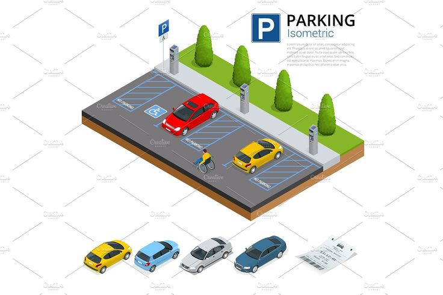

## Project Title

# Valley 360 Smart Parking Platform


An end-to-end smart parking platform that helps drivers find and book parking quickly while giving owners and admins real-time operational control.

## Screenshots / Demo GIF

- Main UI preview (existing asset):
  
- Banner preview (existing asset):
  
- Add these for a stronger portfolio demo:
  - `docs/screenshots/admin-dashboard.png`
  - `docs/screenshots/owner-risk-monitor.png`
  - `docs/screenshots/user-booking-flow.gif`

## Project Overview

Urban parking is fragmented: drivers lose time searching, owners struggle with slot utilization, and admins lack a unified control view. This project solves that problem through role-based parking discovery, booking, validation, and analytics in one system.

Practical value:

- Faster parking discovery for customers.
- Better inventory control and insights for parking owners.
- Centralized governance and risk visibility for admins.

Detailed technical references are in:

- [docs/API.md](docs/API.md)
- [docs/DB_SCHEMA.md](docs/DB_SCHEMA.md)
- [docs/ARCHITECTURE.md](docs/ARCHITECTURE.md)
- [docs/DEPLOYMENT.md](docs/DEPLOYMENT.md)

## Key Features

- JWT-based multi-role authentication (Admin, Owner, Customer).
- Parking area and slot management workflows.
- Location-aware nearby parking discovery.
- Booking flow with QR validation support.
- Reviews and ratings with AI-assisted sentiment and issue flags.
- Owner trust/risk monitoring and admin analytics dashboards.

## Tech Stack

| Layer | Technologies |
|---|---|
| Frontend | React 18, Vite 5, Tailwind CSS, React Router, Axios |
| Backend | Java 11, Spring Boot 2.7, Spring Security, Spring Data JPA, ModelMapper |
| Database | MySQL 8 |
| AI/ML | Python FastAPI, TextBlob, Pydantic, Uvicorn |
| Maps / APIs | Leaflet + React-Leaflet, OpenStreetMap tiles, OSRM routing |
| Dev Tools | Maven Wrapper, npm, ESLint, PostCSS, Git |

## Architecture Summary

The platform has three modules:

1. `my-project` (React frontend) for role-based dashboards, maps, and booking UX.
2. `BackEnd/Valley360-Parking` (Spring Boot API) for authentication, business logic, and persistence.
3. `ai-service` (FastAPI) for review sentiment scoring and issue detection.

Data flow:

Frontend -> Spring Boot API -> MySQL.
When reviews are submitted, Spring Boot also calls FastAPI AI service -> enriched review analytics return to dashboards.

Full architecture notes: [docs/ARCHITECTURE.md](docs/ARCHITECTURE.md).

## Installation & Setup

- Prerequisites:
  - Java 11+
  - Maven 3.8+ (or use included Maven Wrapper)
  - Node.js 18+ and npm
  - Python 3.10+
  - MySQL 8+
- Clone repository:

```bash
git clone https://github.com/pravin-kavthale/Valley-360-Smart-Parking-Platform.git
cd Valley-360-Parking--main
```

- Install dependencies:

```bash
cd my-project
npm install

cd ../BackEnd/Valley360-Parking
./mvnw dependency:resolve

cd ../../ai-service
pip install -r requirements.txt
```

## Environment Variables

Use this clean baseline:

```env
# BackEnd/Valley360-Parking/.env
SPRING_DATASOURCE_URL=jdbc:mysql://localhost:3306/valley?createDatabaseIfNotExist=true&useSSL=false&allowPublicKeyRetrieval=true
SPRING_DATASOURCE_USERNAME=root
SPRING_DATASOURCE_PASSWORD=root
JWT_SECRET_KEY=replace_with_secure_secret
JWT_EXP_TIMEOUT=3600000
AI_SERVICE_URL=http://localhost:8000

# my-project/.env
VITE_API_BASE_URL=http://localhost:8080

# ai-service/.env
AI_SERVICE_PORT=8000
```

## How to Run

- Backend:

```bash
cd BackEnd/Valley360-Parking
./mvnw spring-boot:run
# Windows alternative: mvnw.cmd spring-boot:run
```

- Frontend:

```bash
cd my-project
npm run dev
```

- AI service:

```bash
cd ai-service
uvicorn main:app --host 0.0.0.0 --port 8000 --reload
```

Run targets:

- Frontend: `http://localhost:5173`
- Backend: `http://localhost:8080`
- AI service: `http://localhost:8000`

## API Docs / Swagger Link

- Swagger UI: `http://localhost:8080/swagger-ui.html`
- OpenAPI JSON: `http://localhost:8080/v3/api-docs`

If not available, start backend first and verify SpringDoc dependency is loaded. Detailed endpoint catalog is in [docs/API.md](docs/API.md).

## Future Roadmap

- Replace hardcoded frontend API URLs with `VITE_API_BASE_URL` usage across components.
- Add Docker and docker-compose for one-command local startup.
- Add integration and component test coverage.
- Add CI pipeline for lint, test, and build checks.
- Add payment integration and booking notifications.

## Author

Pravin Kavthale

- GitHub: https://github.com/pravin-kavthale
- LinkedIn: https://www.linkedin.com/in/pravin-kawthale/
